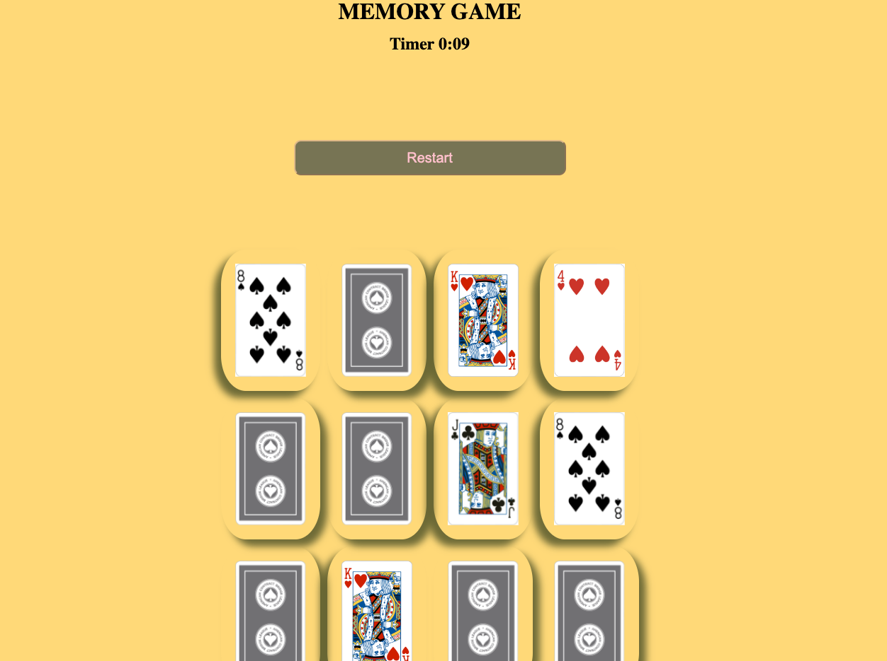

# MEMORY GAME
----------
I developed my very first web app game, a memory card game, using HTML, CSS, and JavaScript. This project combined front-end technologies to create an interactive and engaging user experience. Players match pairs of cards while enjoying a visually appealing design. Game gets started with clicking on the first card. 
Building this game was an exciting introduction to web development and honed my skills in these core web technologies.

A memory game is a type of game that tests and exercises your memory skills. It typically involves a set of cards or tiles with different images, symbols, or patterns. The objective of the game is to find matching pairs of cards by flipping them over and remembering their positions.

At the beginning of the game, all cards are facedown. You will need to  flip over two cards at a time to reveal their images. If the two cards match, they are stayed flipped up. If the cards do not match, they are flipped back facedown. The game continues until all the cards have been matched and removed from the playing area during the given time.

The challenge of the memory game lies in remembering the positions of the cards that have been flipped over. You need to recall the locations of previously seen cards in order to make successful matches and clear the playing area prior time's up. Please see below screenshot as an example of what a memory game looks like. 

Memory games are not only entertaining but also help enhance cognitive skills such as concentration, attention to detail, and short-term memory.

## Example
---------

## Technologies Used
--------
* **HTML**
* **CSS**
* **JavaScript**

## Getting Started
---------

Click [here](https://alirezanava72.github.io/MemoryCardGame/) to play Memory Game. 

## Next Steps
---------
1. Reveal all cards at the end of the game if player cannot complete it
2. Add more cards feature if player wants to increase the difficulty 

